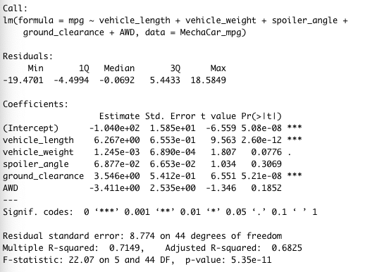
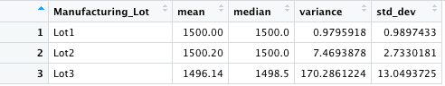
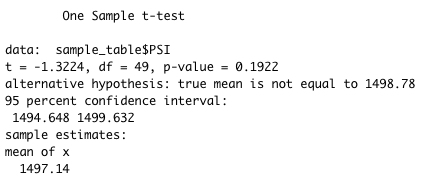
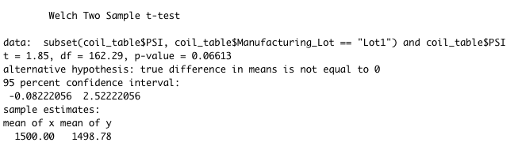
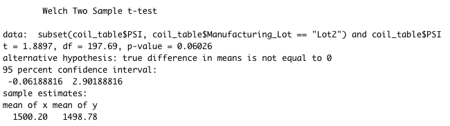
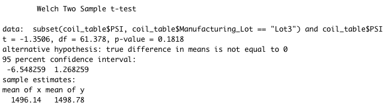

# MechaCar_Statistical_Analysis

## Linear Regression 

Linear Regression is a statistical model used to predict a continues dependent variable based on one or more independent variables.  In Deliverable 1, we use our MechaCar_mpg data to predict MPG using several variables collected from our MechaCar protypes.  These variables include vehicle length, vehicle weight, spoiler angle, drivetrain, and ground clearance.  

Which variables/coefficients provided a non-random amount of variance to the mpg values in the dataset? Based on the p-values, I would say vehicle_length and ground_clearance provide a non-random amount of variance to mpg values.   

Is the slope of the linear model considered to be zero? No, the slope of the linear model is not considered zero.  Why or why not? The F-statistics is not zero and the p-value is 5.35e-11 which is significantly smaller than 0.05. 

Does this linear model predict mpg of MechaCar prototypes effectively? Why or why not? The linear model predicts correctly 68%-71% of the time.  This is based on the R-squared value of 0.7149 and an adjusted R-squared value of 0.6825.

## Summary Statistics on Suspension Coils
The design specifications for the MechaCar suspension coils dictate that the variance of the suspension coils must not exceed 100 pounds per square inch. Does the current manufacturing data meet this design specification for all manufacturing lots in total and each lot individually? Why or why not?

In order to answer this question, we needed to look at the data a few ways.  The first way was to apply the summarize() with our desired values (mean, median, variance and std_deviation) to both the total population and then by the grouped Manufacturing_Lot.

Our total population does meet the design specification for having suspension coils not exceeding 100 pounds per square inch.

When we dive into each manufacturing lot individually, we can see there are differences in the lots that need to be addressed.  Lot3 specifically is outside of the design specifications for manufacturing. 

## T-Tests on Suspension Coils

I ran a two-sided t-test on the general population and on each manufacturing lot.  For the general population I compared it to a random sample size of 50 and used a single sample t-test. 

When we run the t-test on a sample size of 50 against the population we see the mean is NOT equal to 1500 psi.  The p-value was 0.1922 and the mean was 1497.14.

Let’s look a little closer at the three manufacturing lots.  For all three lots, we use a two-sample t-test to see the mean and p-values. 
1.	Lot1, the p-value was 0.06613 and the mean of 1500.00.
2.	Lot2, the p-value was 0.06026 and the mean of 1500.20.
3.	Lot3, the p-value was 0.1818 and the mean of 1496.14.

## Study Design: MechaCar vs Competition.

In our statical review of MechaCar data, we were concerned with mpg against different variables and suspension coil manufacturing psi.  Suspension coils impact comfort of the ride and mpg affects costs to the owner.  I think customers would be interested in understanding repair cost.  To understand repair cost, we need to get a handle on vehicle maintenance at a given point in time.  

We could collect data for repair costs incurred at 50K miles and 100K miles.  We would need this data on a large sampling of manufacturers (competitors) in the same category as MechaCar.  

About the study:
What metric or metrics are you going to test? 
I need the following data for each manufacturer: repair costs and milage.   I would determine the mean costs and mean milage at a minimum. 

What is the null hypothesis or alternative hypothesis?
Null: All manufacturers have the same mean repair costs at 50K miles (and a second run at 100K miles).
Alter: At least one of the manufacturers has a mean repair costs at 50K miles (and a second run at 100K miles) statistically different than the others.

What statistical test would you use to test the hypothesis? And why? We can summarize() the data with mean, medium, variance and std. deviation.   I would also use a one-way analysis of variance (ANOVA) test, which is used to test the means of a single dependent variable across a single independent variable with multiple groups.

